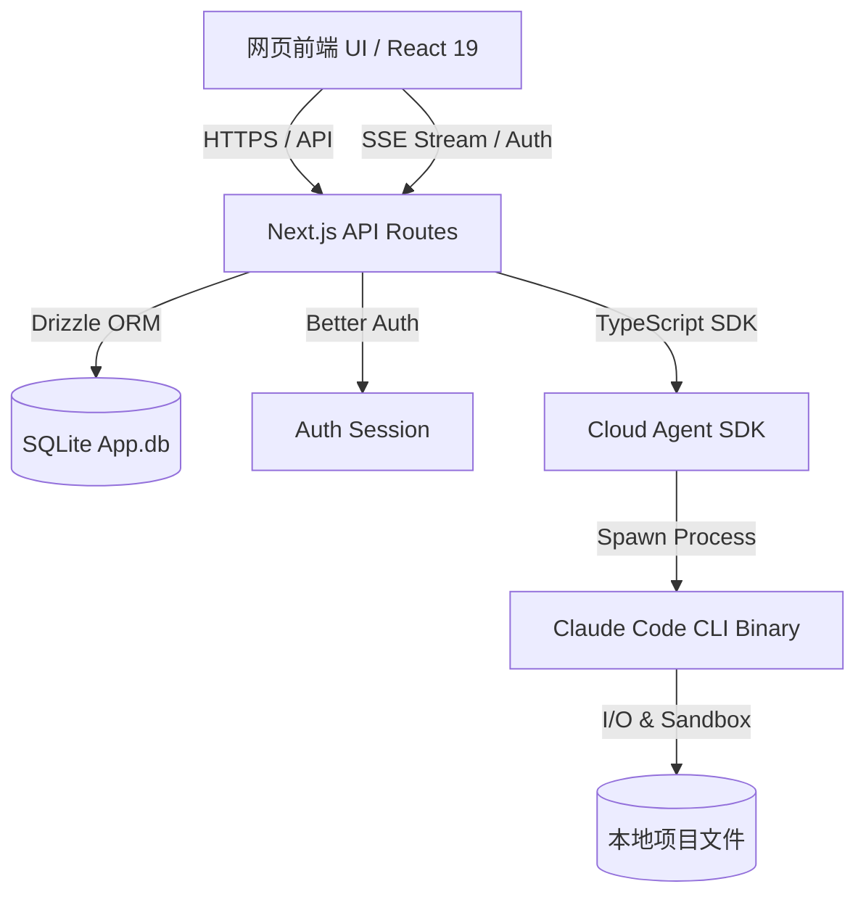
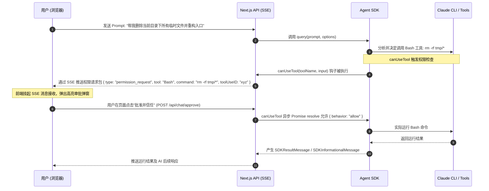

# Cloud Code AI Agent Web 系统需求规格说明书 (PRD)

本文件详细规划了基于 **Cloud Agent SDK (TypeScript)** 的 AI Agent 系统网页应用的设计与开发细节。系统致力于在网页端提供类似于 Claude Code 的高度智能、实时流式响应、具备工程级代码读写与调试能力的 AI 辅助编程环境。

---

## 1. 项目概述

### 1.1 项目名称与定位
* **项目名称**：Cloud Code AI Agent Web
* **系统定位**：一个私有部署/多租户的网页版 Claude Code，让开发者能够通过美观的网页界面管理项目、与 AI 代理进行深度辅助编程对话、解释和调试代码，并借助 SDK 提供的底层能力直接对本地项目代码进行智能重构与版本跟踪。

### 1.2 技术栈与核心依赖
* **核心框架**：Next.js 16 (App Router, React 19)
* **样式与UI**：Tailwind CSS v4 (基于 CSS 变量配置) + shadcn/ui 组件库 (Radix-Vega 风格)
* **数据库层**：Drizzle ORM + LibSQL / SQLite (本地数据存储于 `.data/app.db`)
* **用户认证**：Better Auth (邮箱/密码登录，SQLite 适配器)
* **AI 代理引擎**：`@anthropic-ai/claude-agent-sdk` (版本 `^0.3.183`)
* **核心交互库**：
  * `streamdown` / `@streamdown/code`：用于优雅的 Markdown 与代码块流式渲染
  * `react-resizable-panels`：支持分屏、工作区可拖拽大小调整
  * `sonner`：吐司提示与通知
  * `zustand`：全局状态管理 (管理项目状态、当前会话、消息流、终端输出)
  * `recharts`：Token 消耗、响应时间及 API 费用统计图表

---

## 2. 核心功能需求 (Functional Requirements)

### 2.1 项目创建与管理 (Project Management)
为确保 Agent 执行范围的安全与隔离，系统必须提供明确的“项目（Project）”概念。每个项目映射到一个真实的本地磁盘路径。
1. **新建项目**：
   * 属性：项目名称、物理路径（工作目录 `cwd`，必须是有效的本地绝对路径）、项目描述、默认模型偏好。
   * 初始化：创建项目时，自动检测该路径是否为 Git 仓库。若不是，支持提示用户初始化 Git。
2. **项目编辑**：
   * 支持修改项目基本元数据（名称、描述、默认配置参数）。
3. **项目删除**：
   * 从数据库中移除项目关联。
   * 提供选项：仅删除网页端项目记录，或同时清理项目关联的 `.claude/` 历史和缓存目录。
4. **项目面板 (Dashboard) 查看**：
   * **文件浏览器**：树形展示项目目录结构，支持文件双击查看（代码高亮）。
   * **运行状态**：展示项目相关的活动会话数、历史运行任务、以及当前正在后台运行的 Bash 命令或监控（Monitor）任务。

### 2.2 自然语言对话与辅助编程 (AI Dialog & Assisting Coding)
系统应提供沉浸式的分栏对话界面：左侧为项目管理与文件浏览器，中间为 AI 对话区，右侧为当前文件预览/差异对比。
1. **自然语言编程对话**：
   * 支持流式（Streaming）对话，AI 回复时不仅流式输出文字，还需流式展示思考过程（Thinking Processes）。
   * 在使用具有推理能力的模型（如 Claude Opus 4.6+）时，支持**自适应思考 (Adaptive Thinking)** 的折叠展开显示，提供极致的透明度。
2. **代码生成与优化**：
   * 支持通过指令要求 AI 对指定文件生成新代码或重构代码。
   * AI 生成的代码应具备“一键应用”或“应用到文件”功能：
     * **差异对比 (Diff View)**：在写入文件前，网页端以 Side-by-Side 形式展示修改前后的差异，供用户审查。
     * **快速写入**：用户确认后，后端调用 SDK 的 `Write` 或 `Edit` 工具将代码持久化到磁盘中。
3. **对话管理与会话分叉**：
   * **新建会话**：重置 AI 上下文。
   * **会话恢复**：基于 SDK 的 `resume` 和 `resumeSessionAt` 功能，用户可以随时回到历史任意一轮对话，甚至恢复特定的消息节点。
   * **会话分叉 (Fork Session)**：从历史会话的某一步中分叉出新会话，尝试不同的重构路径，而不会破坏原有会话历史。

### 2.3 代码解释与调试辅助 (Explainer & Debugging Assistant)
网页版系统必须深度集成 Cloud Agent SDK 的工具系统，使 AI 不仅能“动口”还能“动手”。
1. **代码解释与审查**：
   * 用户可以直接右键文件树中的文件或在对话框中 `@` 某个文件，要求 AI 解释其架构、流程或查找潜在 Bug。
2. **自动化调试辅助**：
   * **运行控制台**：AI 可以自主运行构建或测试命令（如 `npm run test` 或 `pytest`）。
   * **错误日志捕获**：当命令执行失败时，AI 可以读取 stderr，并通过 Grep 查找错误源文件，自行规划修复方案。
3. **工具执行可视化轨迹**：
   * AI 在工作时会调用多种内置工具：`FileRead`、`FileWrite`、`FileEdit`、`Bash`、`Grep`、`Glob` 等。
   * 对话流中应当以特定的卡片形式展示 AI 正在调用的工具、输入的参数、执行进度以及返回的结果。
   * 对于耗时操作（如大型 Grep 搜索或编译），展示 `SDKToolProgressMessage` 提供的已用时间和进度指示。

### 2.4 版本控制与历史记录跟踪 (Version Control & History)
1. **Git 实时状态监控**：
   * 项目视图中直观显示未提交的修改文件列表，带有 Git 状态标识（Modified, Added, Deleted）。
   * 对话过程中，若 AI 修改了代码，自动刷新 Git 差异视图，展示具体的 Diff 补丁。
2. **历史记录与会话审计**：
   * 调用 `listSessions` 接口，按 `lastModified` 倒序列出所有历史会话，包括其首个提示词、所在 Git 分支、上次修改时间以及文件大小。
   * 提供会话检索、批量加标签（`tagSession`）和重命名（`renameSession`）功能。
3. **文件更改检查点与回滚 (Checkpoints)**：
   * 开启 `enableFileCheckpointing` 选项。
   * 记录 AI 对文件的每一次修改。如果 AI 的修改导致系统无法编译或产生异常，用户可以通过网页端点击“回滚”按钮，将项目文件还原到修改前的健康状态。

---

## 3. 技术架构与核心设计

### 3.1 整体架构图


### 3.2 关键交互流程：交互式工具权限审批
Cloud Agent SDK 在执行敏感的修改（如 Bash 执行、文件写操作）时，支持通过权限钩子（`canUseTool`）由宿主决定是否批准。在本系统中，这一流程必须在网页端实现双向反馈：



---

## 4. 数据库设计 (Drizzle Schema)

为了记录用户的项目信息，我们需要在 `db/schema.ts` 中扩展项目及会话关联表。以下为规划的表结构设计：

```typescript
import { sqliteTable, text, integer, index } from "drizzle-orm/sqlite-core";
import { user } from "./auth-schema";

// 项目表
export const projects = sqliteTable("project", {
    id: text("id").primaryKey(),                 // UUID
    name: text("name").notNull(),               // 项目显示名称
    path: text("path").notNull(),               // 物理目录绝对路径
    description: text("description"),           // 项目描述
    userId: text("user_id")                     // 关联的用户ID
        .notNull()
        .references(() => user.id, { onDelete: "cascade" }),
    createdAt: integer("created_at", { mode: "timestamp" }).notNull(),
    updatedAt: integer("updated_at", { mode: "timestamp" }).notNull(),
}, (table) => [
    index("project_userId_idx").on(table.userId),
]);

// 会话与项目的映射表 (除了SDK本地JSONL存储，数据库同步记录元数据，方便多租户快速检索)
export const projectSessions = sqliteTable("project_session", {
    sessionId: text("session_id").primaryKey(), // SDK 产生的 sessionUuid
    projectId: text("project_id")               // 关联的项目ID
        .notNull()
        .references(() => projects.id, { onDelete: "cascade" }),
    title: text("title").notNull(),             // 会话标题
    gitBranch: text("git_branch"),              // 所在分支
    lastActiveAt: integer("last_active_at", { mode: "timestamp" }).notNull(),
}, (table) => [
    index("session_projectId_idx").on(table.projectId),
]);
```

---

## 5. API 接口设计规划

### 5.1 项目管理接口
* **`GET /api/projects`**
  * 描述：获取当前用户的所有项目列表。
  * 安全：需 Better Auth 登录 Session 校验。
* **`POST /api/projects`**
  * 描述：创建新项目。需要校验 `path` 在服务器端是否真实存在、是否具有读写权限。
* **`PUT /api/projects/[id]`**
  * 描述：修改项目信息。
* **`DELETE /api/projects/[id]`**
  * 描述：删除项目。

### 5.2 核心 AI 会话流式接口
* **`GET /api/chat/stream`**
  * 描述：使用 Server-Sent Events (SSE) 流式传输 AI 的对话信息。
  * 参数：`projectId`（项目ID）、`sessionId`（可选，用于恢复会话）、`prompt`（提示词）。
  * 内部逻辑：
    1. 根据 `projectId` 查出项目物理路径 `cwd`。
    2. 调用 `query()` 异步生成器。配置 `options`：
       ```typescript
       {
           cwd: project.path,
           resume: sessionId,
           permissionMode: "default",
           enableFileCheckpointing: true,
           canUseTool: async (toolName, input, opts) => {
               // 1. 将权限请求挂起到全局暂存区，并分配 requestId
               // 2. 通过 SSE 发送 "permission_required" 事件给前端
               // 3. 阻塞等待用户在网页端的审批响应
               // 4. 返回批准 { behavior: "allow" } 或拒绝 { behavior: "deny" }
           }
       }
       ```
    3. 流式解析返回的 `SDKMessage`，将其转换成前端友好的 SSE 事件推送到网页。
* **`POST /api/chat/approve`**
  * 描述：用户在网页端对挂起的权限请求进行“同意”或“拒绝”操作。
  * 载荷：`requestId`（权限请求ID）、`action`（`approve` | `deny`）、`userInput` (可修改后的参数)。

---

## 6. 非功能性需求与交互体验

### 6.1 视觉设计 (Aesthetics)
* **沉浸式模式**：默认采用亮色色，符合专业开发者审美。
* **高响应式布局**：基于 `react-resizable-panels` 的三栏式经典 IDE 布局：
  * **左栏**：项目/文件管理器 + 历史会话列表（可折叠）。
  * **中栏**：AI 交互聊天区。不仅有输入框，还有智能快捷指令按钮（如一键“解释代码”、“运行测试”、“分析错误”）。
  * **右栏**：当前文件预览与修改 Diff 视图。当 AI 修改代码后，自动拉起 Diff 动画，增强视觉反馈。
* **流式气泡设计**：对于 AI 的“推理思考 (Thinking)”，采用磨砂玻璃质感（Glassmorphism）的卡片进行收纳，并默认折叠。用户点击可查看完整的底层推理。

### 6.2 安全隔离 (Sandbox & Security)
由于 AI Agent 能够通过 `Bash` 执行任意命令，为了防止本地环境被破坏：
* **沙箱启用**：在配置中默认开启 SDK 的 `SandboxSettings.enabled: true`。
* **文件系统写限制**：利用 `allowWrite` 限制 AI 只能修改当前项目目录下的文件。
* **网络防火墙**：通过 `SandboxNetworkConfig` 拦截未经许可的外部域名连接，仅允许拉取包依赖和查阅文档的白名单域名。
* **默认高危拦截**：除沙箱外，对于任何带有 `dangerouslyDisableSandbox` 属性的工具调用，强制在 `canUseTool` 中拦截并发出浏览器置顶红色警告，要求人工确认。

### 6.3 性能优化
* **预热机制**：页面加载或项目切换时，提前在后台触发 SDK 的 `startup()` 函数进行子进程的预热和初始化，将首次对话响应延迟降到 100ms 以内。
* **编译优化**：由于 Next.js 运行在 Node.js 环境中，SDK 二进制依赖能够直接按平台自动装载。确保构建打包时不对本地 CLI 二进制进行不当的打包压缩。
